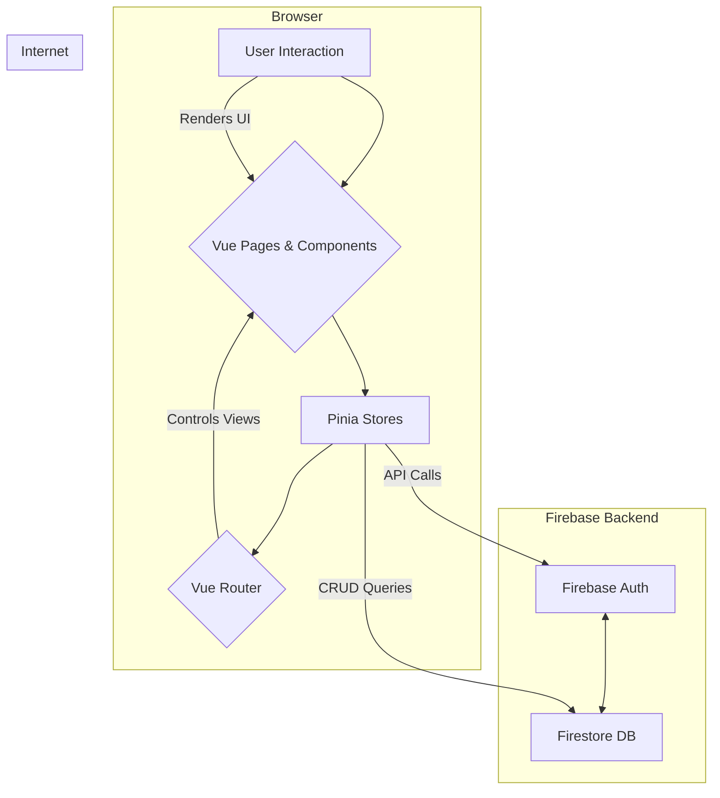

# AC-Work: Architecture & Developer Guide

---

**Version:** 1.0.0
**Last Updated:** 2025-07-20
**Primary Maintainer:** [Your Name/Team]

---

## 1. 📖 Project Philosophy & Goals

**AC-Work**는 현장 기술 및 서비스 직원의 운영 효율성 극대화를 목표로 하는 포괄적인 관리 솔루션입니다. 이 프로젝트의 핵심 철학은 다음과 같습니다:

- **중앙화된 정보(Centralized Information):** 분산된 일정, 고객 정보, 작업 내역을 단일 대시보드에서 관리하여 정보의 파편화를 방지합니다.
- **업무 자동화(Task Automation):** 수동으로 처리하던 급여 정산, 견적서 및 거래명세서 작성을 자동화하여 관리자의 운영 부담을 획기적으로 줄입니다.
- **데이터 기반 의사결정(Data-Driven Decisions):** 축적된 작업 데이터를 분석하여 비즈니스 인사이트를 도출할 수 있는 기반을 마련합니다.
- **개발 및 유지보수 용이성(Maintainability):** 최신 기술 스택과 명확한 아키텍처를 채택하여 새로운 기능을 쉽게 추가하고 안정적으로 유지보수할 수 있도록 설계되었습니다.

## 2. 🏛️ System Architecture

본 시스템은 **Vue.js 3 기반의 SPA**와 **Firebase (BaaS)**를 결합한 현대적인 서버리스 아키텍처를 따릅니다.

### 2.1. Architectural Diagram



### 2.2. Technology Rationale

- **Vue.js 3 (Composition API):** 복잡한 비즈니스 로직을 기능 단위로 캡슐화하는 데 용이하여, `Schedule`, `Payroll` 등 각 도메인 로직의 응집도를 높입니다. 재사용 가능한 로직은 `composables`로 분리하여 관리합니다.
- **Vite:** 빠른 개발 서버 구동과 효율적인 HMR(Hot Module Replacement)을 통해 개발 생산성을 극대화합니다.
- **Vuetify 3:** 검증된 Material Design 시스템을 제공하여 UI/UX 개발 시간을 단축하고, 애플리케이션 전체의 디자인 일관성을 보장합니다.
- **Pinia 2:** 모듈화된 스토어 설계가 용이하고, Vue Devtools와의 완벽한 통합을 통해 상태 변화를 직관적으로 디버깅할 수 있습니다. `userStore`, `scheduleStore`, `uiStore`, `workerStore` 등 도메인별로 스토어를 분리하여 관리합니다.
- **Firebase (Serverless):** 별도의 백엔드 서버 구축 및 관리 없이 인증, 데이터베이스, 호스팅을 해결합니다. 이를 통해 프론트엔드 개발에 모든 리소스를 집중할 수 있으며, 확장성이 뛰어납니다.

## 3. 🗃️ Data Modeling (Cloud Firestore)

Firestore는 NoSQL 문서 기반 데이터베이스이며, 아래와 같은 컬렉션 구조를 가집니다.

### `users` collection
- **Purpose:** 사용자 정보 및 역할 저장
- **Document ID:** `Firebase Auth UID`
- **Schema:**
  ```json
  {
    "uid": "string",
    "email": "string",
    "name": "string",
    "role": "string" // 'admin' or 'worker'
  }
  ```

### `schedules` collection
- **Purpose:** 개별 작업 일정 및 상세 정보 저장
- **Document ID:** Auto-generated ID
- **Schema:**
  ```json
  {
    "building": "string",
    "unit": "string",
    "room": "string",
    "tasks": [{"name": "string", "count": "number"}],
    "status": "string", // '진행', '완료', '보류', '취소됨'
    "date": "Timestamp",
    "memo": "string",
    "invoice": "boolean",
    "createdBy": "string" // users.uid 참조
  }
  ```

### `schedulesMeta` collection
- **Purpose:** 특정 날짜의 메타 정보(공지, 작업자 등) 관리
- **Document ID:** Auto-generated ID
- **Schema:**
  ```json
  {
    "date": "string", // YYYY-MM-DD
    "startTime": "string",
    "workers": ["string"], // users.uid 배열
    "notice": "string",
    "paidMap": {"userId": "boolean"} // 작업자별 정산 여부
  }
  ```

### `products` collection
- **Purpose:** 견적서/거래명세서에 사용될 품목 정보 저장
- **Document ID:** Auto-generated ID
- **Schema:**
  ```json
  {
    "name": "string",
    "spec": "string",
    "price": "number"
  }
  ```

## 4. ⚙️ Core Logic & Implementation

### 4.1. Authentication & Authorization
- **Flow:**
  1. `LoginView.vue`에서 ID/PW 입력 시, Firebase `signInAnonymously`로 익명 인증 후 Firestore `users` 컬렉션에서 사용자 정보 검증.
  2. 인증 성공 시, `userStore`에 사용자 정보(ID, 이름, 역할) 저장 및 `localStorage`에 영속화.
  3. `router/index.js`의 `beforeEach` 가드에서 라우트 이동 전 인증 상태 및 `meta.requiresAuth`를 검사하여 페이지 접근 제어.

### 4.2. State Management (Pinia)
- **`userStore`:** 사용자 인증, 정보 관리, `localStorage` 동기화.
- **`scheduleStore`:** `schedules` 및 `schedulesMeta` 컬렉션과의 모든 Firestore 상호작용(CRUD)을 캡슐화. 필터링 로직 포함.
- **`uiStore`:** 전역 UI 상태(스낵바 등) 관리.
- **`workerStore`:** 작업자 목록 및 선택된 작업자 상태 관리.

### 4.3. Document Generation (`EstimateForm.vue`, `StatementForm.vue`)
- **Process:**
  1. 사용자가 폼에 데이터를 입력하거나, Firestore `products` 컬렉션에서 품목을 선택.
  2. `html2canvas`가 Vue 컴포넌트로 구현된 미리보기 영역의 DOM을 이미지(canvas)로 캡처.
  3. `jspdf` 라이브러리가 캡처된 이미지를 PDF 문서에 삽입하여 생성.
  4. 생성된 PDF/이미지를 사용자에게 다운로드.
- **Key Consideration:** A4 용지 비율과 해상도에 맞춰 컴포넌트의 스타일(CSS)을 정밀하게 조정해야 합니다.

## 5. 🚀 Setup & Deployment

### 5.1. Prerequisites
- Node.js `v18.x` or `v20.x`
- npm `9.x` or later
- Firebase 프로젝트 생성 및 설정

### 5.3. Local Development

```bash
# 1. Install dependencies
npm install

# 2. Run the development server (with HMR)
npm run dev
```

### 5.4. Building for Production

```bash
# 1. Build the application
npm run build

# 2. Preview the production build locally
npm run preview
```

### 5.5. Deployment

빌드 결과물(`dist/` 디렉토리)은 정적 파일이므로, **Firebase Hosting**, Vercel, Netlify 등 모든 정적 호스팅 서비스에 배포할 수 있습니다.

## 6. 🎨 Code Conventions & Style Guide

- **Naming:**
  - Components: `PascalCase` (e.g., `ScheduleCard.vue`)
  - Composables: `camelCase` (e.g., `usePdfGenerator.js`)
  - Stores: `camelCase` (e.g., `userStore.js`)
- **Component Structure:** `<script setup>`을 사용하며, `<template>`, `<script>`, `<style>` 순서를 따릅니다.
- **Imports:** 라이브러리, 외부 모듈, 내부 모듈 순으로 그룹화합니다. 경로 별칭(`@/`)을 적극적으로 사용합니다.
- **Commits:** [Conventional Commits](https://www.conventionalcommits.org/) 표준을 따르는 것을 권장합니다. (e.g., `feat:`, `fix:`, `docs:`, `refactor:`)